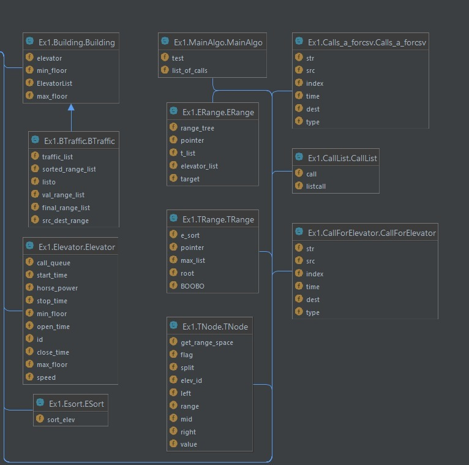

# OOP_Ex1_Py
Assignment ex1

Main algo :
by finding all the crowded areas of calls we can allocate the best elevator 
The best elevator is the one that makes the most range in less time .

class Building:
This class reads the json file and gets the min floor , max floor and array of elevator .

class Elevator :
This class  represents elevators. Each elevator have different feature and the main of them is horsepower .

class E sort :
This class sorts an array of elevators by horsepower .

class Call list :
This class reads the csv file and get all the calls for the elevator .

class call for elevator :
This class gives the info of the call like src ,dest  , time  .

class B traffic :
This class  gets all the calls and elevator , by going on the building floor we add +1 on all the floors over the( src - dest) and +2 for the floor src and dest.
so we can find the traffic area.

calls T NODE class :
this class has node and each node represents the range of the current elevator and pointing on the next traffic area 

class T Range  : 
this class is the data structures of the T node in addition this data structure use to  search and allocate elevator 
to call from the call list use by the main algorithm .

